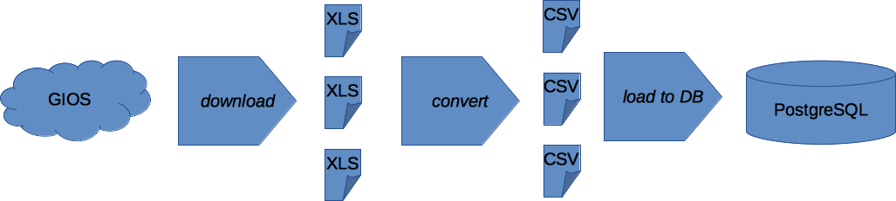

# Datasources
1. **GIOS** http://powietrze.gios.gov.pl/pjp/archives
2. **Meteo** https://dane.imgw.pl/#dane-pomiarowo-obserwacyjne

# Systems & platforms
1. Initialy - MySQL
2. Target - PostgreSQL
3. R and Python

# Steps
1. Download Excel files
2. Convert Excel files to CSV
3. Load CSV to the DB
4. Merge staging tables into tables by pollution type and time granulation
5. Merge all data into one final table
6. Load metadata for monitoring stations

